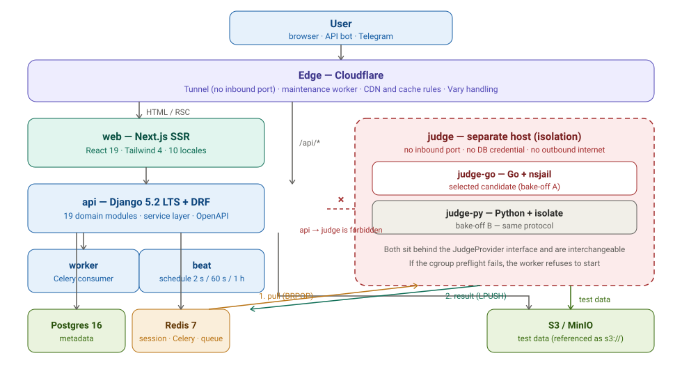
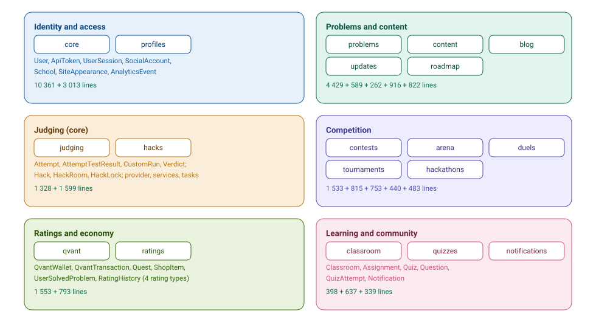
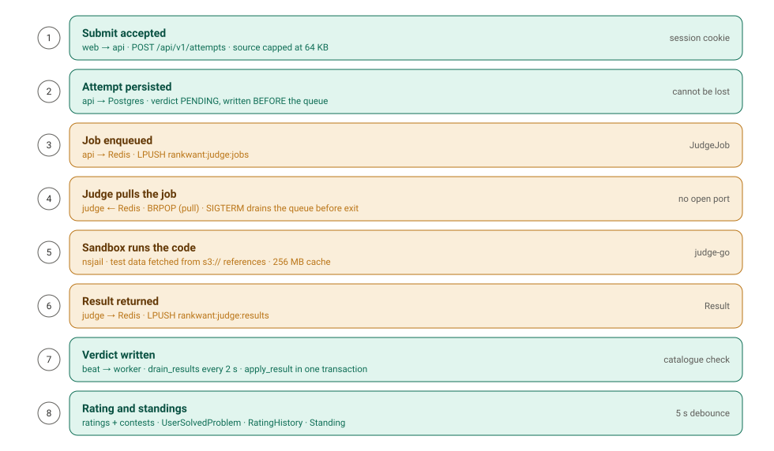
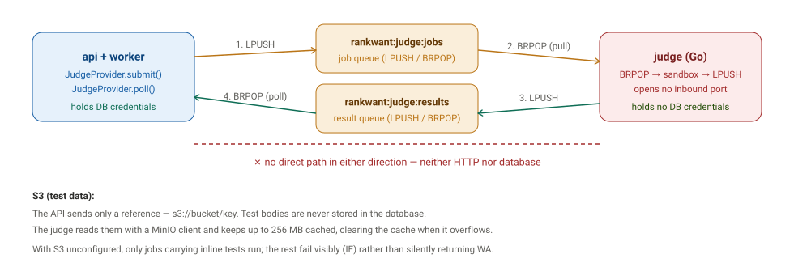
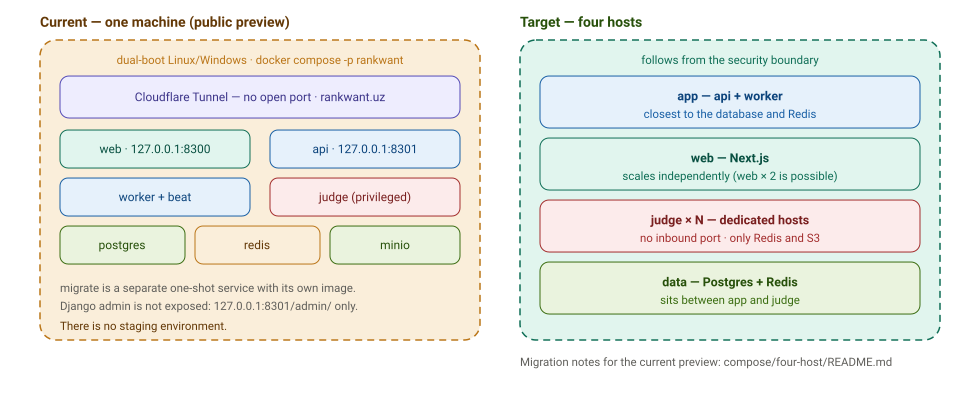

# RankWant — architecture diagram set

**Date:** 2026-09-20
**Status:** dated record, not living documentation
**Source:** `apps/api`, `apps/web`, `services/judge-go`, `docker-compose*.yml`,
`docs/06-architecture` (locked 2026-09-06), `docs/10-operations/parallel-agents.md`

> Dated session record. The authoritative rules live in `docs/01`–`docs/10` and the
> [ADRs](../../07-adr/); where this text disagrees with them, those win. If the code
> contradicts them, that calls for a new ADR.

## What this is

Five **renderable SVG assets** for the as-built architecture. They are plain `.svg`
files, so they can be embedded in issues, PRs, slides or an external document, and they
render identically everywhere — no Mermaid runtime, no GitHub-only features.

The written analysis is **not duplicated here**. It lives in the sibling record
`docs/research/2026-09-20-as-built-architecture/` (`README.md`, `MODULES.md`,
`FLOWS.md`, `DIAGRAMS.md`), which is the text of record for the same subject.
That record's `DIAGRAMS.md` uses Mermaid source; this directory ships the same subject
as standalone image assets. Use whichever the medium needs.

## The set

| # | File | Shows |
|---|---|---|
| 1 | [01-layers.svg](diagrams/01-layers.svg) | The five layers plus the isolated judge host, and the security boundary between them |
| 2 | [02-modules.svg](diagrams/02-modules.svg) | The 19 Django domain modules grouped into six domains, with measured line counts |
| 3 | [03-submit-to-rating.svg](diagrams/03-submit-to-rating.svg) | The eight-step path from submit to rating and standings |
| 4 | [04-judge-protocol.svg](diagrams/04-judge-protocol.svg) | The pull protocol: two Redis queues, four directions, zero direct calls |
| 5 | [05-deploy-topology.svg](diagrams/05-deploy-topology.svg) | The current single-machine preview beside the target four-host topology |

### 1. Layers

User, Cloudflare edge, Next.js web, Django api/worker/beat, and the data tier. The judge
sits behind a dashed boundary: it reaches Redis and S3, and nothing else. `api → judge` is
drawn as a struck-through line because it is not merely discouraged — the judge refuses to
start when `DATABASE_URL` is present.

### 2. Module map

Six domains, 19 modules. Line counts were measured with `migrations/` and `__pycache__`
excluded. `core` is the largest module and carries identity, sessions, the email chain,
OAuth, Turnstile and i18n.

### 3. Submit to rating

Green steps touch the API and the database; amber steps touch the queue and the judge.
Step 2 is the load-bearing one: the attempt is persisted **before** it is enqueued, which is
why a queue failure cannot lose a submission.

### 4. Judge protocol

Two Redis list keys carry the whole integration. The judge pulls; nothing is ever pushed at
it. `JudgeJob` and `Result` are the only two shapes that cross the boundary.

### 5. Deploy topology

The left panel is what actually runs today; the right panel is the topology the security
boundary implies. The gap between them is deliberate and is documented in
`docs/06-architecture`.

## Regenerating

The SVGs are hand-written, not generated. Text is set with `dominant-baseline="central"`
and an opaque white background so each file stays legible on light and dark surfaces alike.
Edit the `.svg` directly; keep the viewBox and the layout constants intact.
