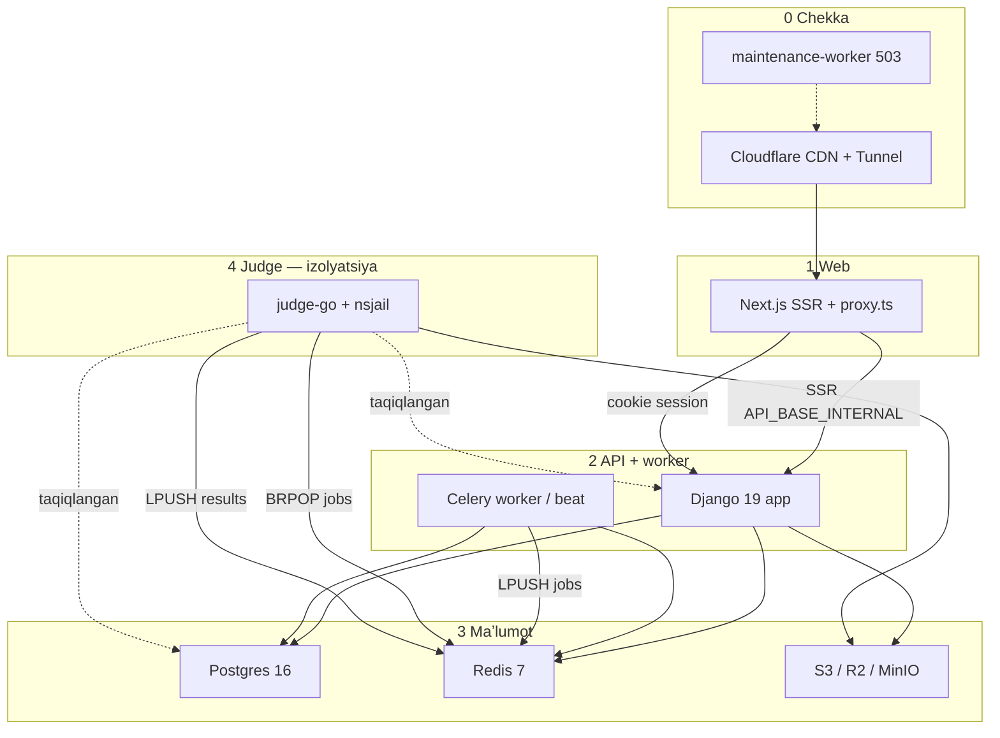
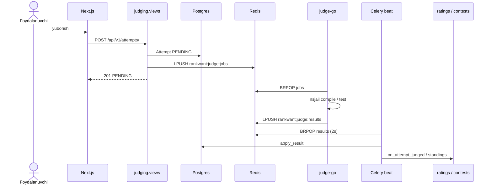
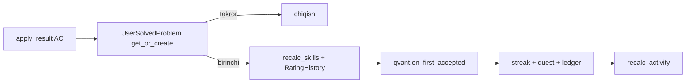
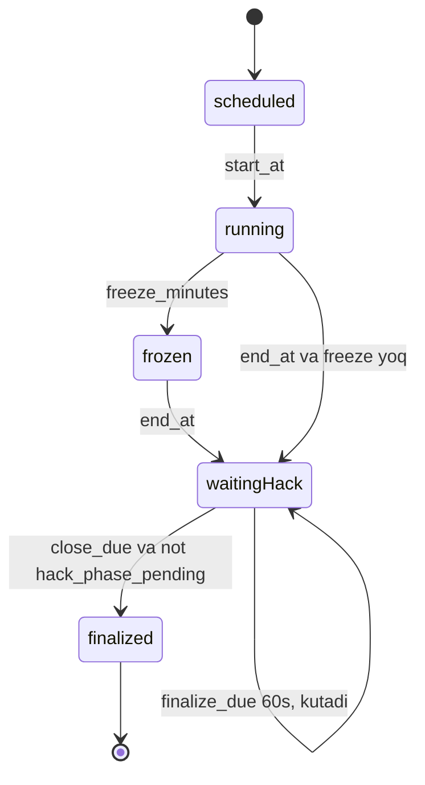
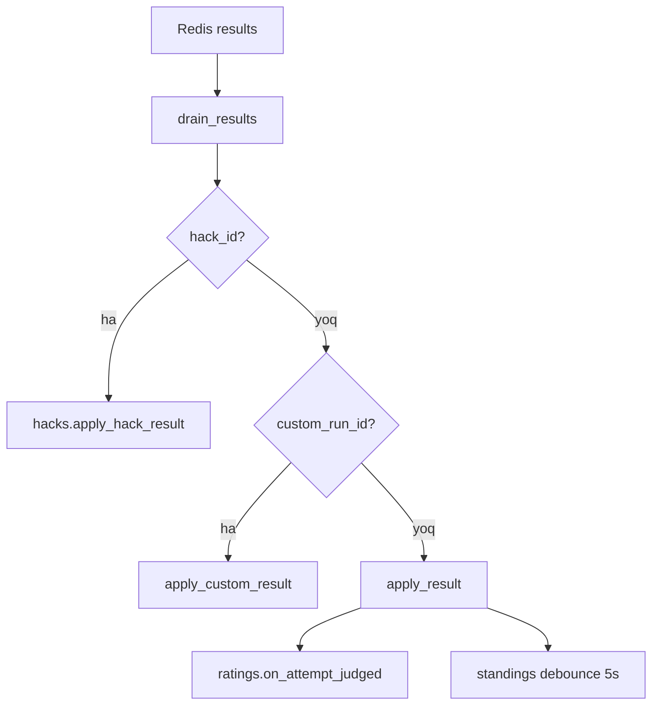

# Diagrammalar

**Sana:** 2026-09-20 · [orqaga](README.md)

GitHub Mermaid. Matnli tushuntirish: [README](README.md), [MODULES](MODULES.md), [FLOWS](FLOWS.md).

## Qatlamlar

## Submit zanjiri

## Birinchi AC

## Musobaqa yakuni

## Drain marshruti

